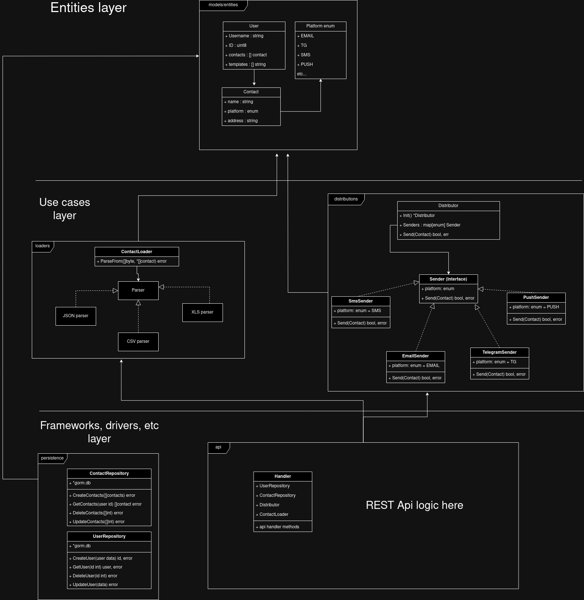

# emergency-notification-system

### Функциональные требования
Пользователь может добавить список людей, с указанием всех их контактов, после чего, 1-м запросом пользователь может отправлять сообщение на каждый из указанных контактов каждого человека.

#### Можно отсылать сообщения в:
- SMS
- Telegram
- Email
- Push

#### Пользователь может загружать данные о контактах для рассылки при помощи:
- JSON
- xls
- csv

## Архитектура
